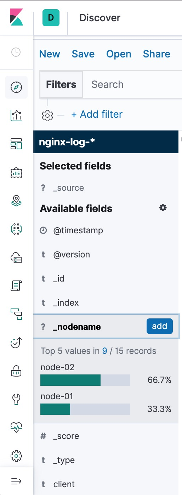

# ELK

参考文章

1. [Logstash filter 的使用](https://techlog.cn/article/list/10182917)

相比第一个实例, 本实例将nginx部署了2个节点, 同时也部署了2个logstash实例, 分别处理这两个nginx节点的日志, 用来模拟实际场景中多项目, 多节点的情况.

在操作上与示例01没什么区别, 区别只在于pipeline目录中, 配置文件使用filter为每个节点添加了一`_nodename`字段, 用于区别不同节点.

